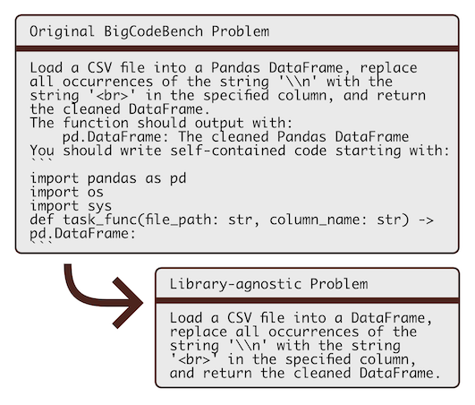

# **Project Datasets**

This directory contains all of the datasets used in the project, with detailed descriptions.

## *contents*

- `language/` - data used for *language* experiments.
    - `project_init_tasks.json` - project descriptions to be used as prompts.
    - `benchmark_tasks/` - natural language coding problems from existing datasets.
        - `aixbench.json` (129 records) - the `raw_nl` data from the AixBench NL task dataset, 2022.
            - *Cuts: problems containing chinese characters have been removed.*
        - `apps_competition.json` (200 records) - the `question` data from the APPS (train and test) dataset, for problems with `difficulty = competition`, 2021.
        - `apps_interview.json` (200 records) - the `question` data from the APPS (train and test) dataset, for problems with `difficulty = interview`, 2021.
        - `apps_introductory.json` (200 records) - the `question` data from the APPS (train and test) dataset, for problems with `difficulty = introductory`, 2021.
        - `codecontests.json` (200 records) - samples of the `description` data from the CodeContests dataset, distributed evenly over the different difficulties, 2022.
        - `conala.json` (200 records) - the `rewritten_intent` data from the CoNaLa (train and test) dataset, 2018.
        - `mx_humaneval.json` (161 records) - the `description` data from the MxEval Multi-HumanEval dataset, 2023.
        - `mx_mbxp.json` (200 records) - the `description` data from the MxEval MBXP dataset, 2023.
- `library/` - data used for *library* experiments
    - `benchmark_tasks.json` - problem statements to be used as prompts, curated from the BigCodeBench dataset.
    - `bigcodebench_stats.json` - data about the BigCodeBench dataset, before and after processing for use.
    - `library_stats.json` - GitHub data about libraries used in case analysis.
    - `project_init_tasks.json` - project descriptions to be used as prompts.
    - `bigcodebench/` - raw data from the BigCodeBench dataset
        - `bigcodebench_all.json` (1140 records) - the `instruct_prompt` and `libs` data from the BigCodeBench dataset, 2024.
        - `bigcodebench_ext.json` (813 records) - BigCodeBench problems that include external libraries.
        - `lib2domain.json` - mapping of libraries to domains.
        - `task2domain.json` - mapping of BigCodeBench problems to domains.

*The following datasets had problems that referenced a coding language or library removed: Aix-Bench, APPS, CoNaLa, CodeContests.*

## *BigCodeBench processing*

BigCodeBench problems needed extra processing to be suitable for checking the library preferences of LLMs.
The function output and Python imports were removed from the end of each problem's natural language description.
The transformation is shown in the image below, and fully described in Section 3.4.1 of the paper.

The table below shows a full breakdown of BigCodeBench problems per domain, both before and after processing.
The count of problems is given, with the number of expected different libraries in brackets.

| **Domain**      | **Original Dataset**  | **After Processing** |
|-----------------|---------------|----------------------|
| General         | 504 (27)      | 208 (21)             |
| Computation     | 720 (40)      | 444 (26)             |
| Visualisation   | 348 (25)      | 243 (21)             |
| System          | 338 (38)      | 69 (22)              |
| Time            | 112 (13)      | 55 (9)               |
| Network         | 94 (27)       | 34 (9)               |
| Cryptography    | 61 (12)       | 8 (8)                |
| **Total across all domains**     | **1140 (62)**     | **526 (35)**         |

## *references*

[AixBench](https://huggingface.co/datasets/xin1997/aixbench-manual_all_only_input) - Y. Hao et al., ‘AixBench: A Code Generation Benchmark Dataset’, Jul. 21, 2022, arXiv: arXiv:2206.13179. doi: 10.48550/arXiv.2206.13179.

[APPS (Automated Programming Progress Standard)](https://huggingface.co/datasets/codeparrot/apps) - D. Hendrycks et al., ‘Measuring Coding Challenge Competence With APPS’, in Proceedings of the Neural Information Processing Systems Track on Datasets and Benchmarks 1, NeurIPS Datasets and Benchmarks 2021, December 2021, virutal, arXiv, Nov. 2021. doi: 10.48550/arXiv.2105.09938.

[BigCodeBench](https://huggingface.co/datasets/bigcode/bigcodebench) - T. Y. Zhuo et al., ‘BigCodeBench: Benchmarking Code Generation with Diverse Function Calls and Complex Instructions’, in 13th International Conference on Learning Representations (ICLR25), arXiv, Oct. 2024. doi: 10.48550/arXiv.2406.15877.

[CodeContests](https://huggingface.co/datasets/deepmind/code_contests) - Y. Li et al., ‘Competition-level code generation with AlphaCode’, Science, vol. 378, no. 6624, pp. 1092–1097, 2022, doi: 10.1126/science.abq1158.

[CoNaLa (Coding in Natural Language)](https://huggingface.co/datasets/neulab/conala) - P. Yin, B. Deng, E. Chen, B. Vasilescu, and G. Neubig, ‘Learning to Mine Aligned Code and Natural Language Pairs from Stack Overflow’, in Proceedings of the 15th International Conference on Mining Software Repositories, {MSR} 2018, Gothenburg, Sweden, May 28-29, 2018, arXiv, May 2018. doi: 10.48550/arXiv.1805.08949.

[MxEval (Multi-HumanEval and MBXP)](https://huggingface.co/mxeval) - B. Athiwaratkun et al., ‘Multi-lingual Evaluation of Code Generation Models’, in The Eleventh International Conference on Learning Representations, {ICLR} 2023, Kigali, Rwanda, May 1-5, 2023, arXiv, Mar. 2023. doi: 10.48550/arXiv.2210.14868.
